# Validation Previews

This document shows examples of validation previews generated during the model training process. These previews help in visualizing the model's performance on the validation dataset.

## CNN

### Position Independent

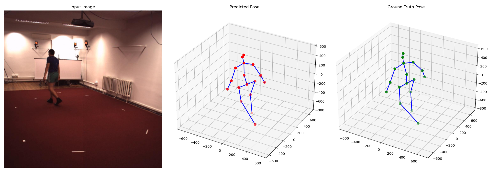
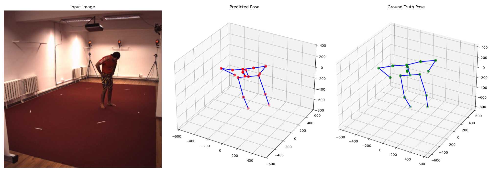
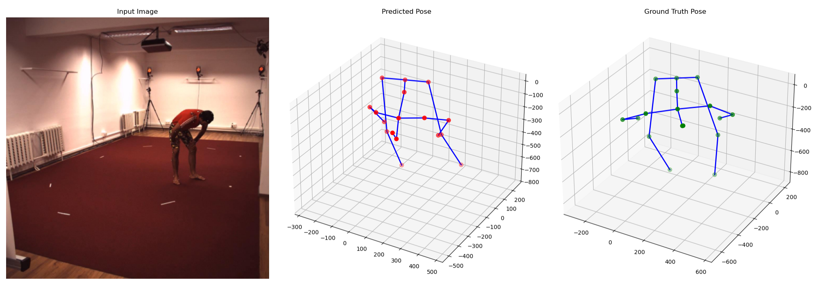
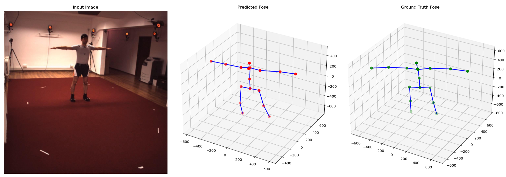
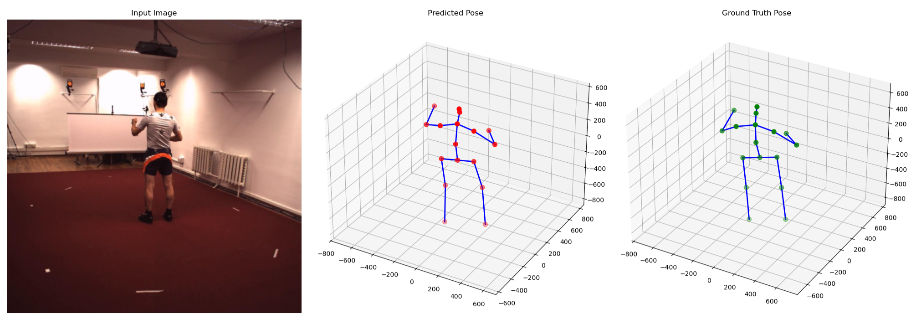

### Position Dependent

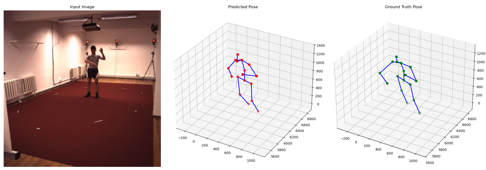

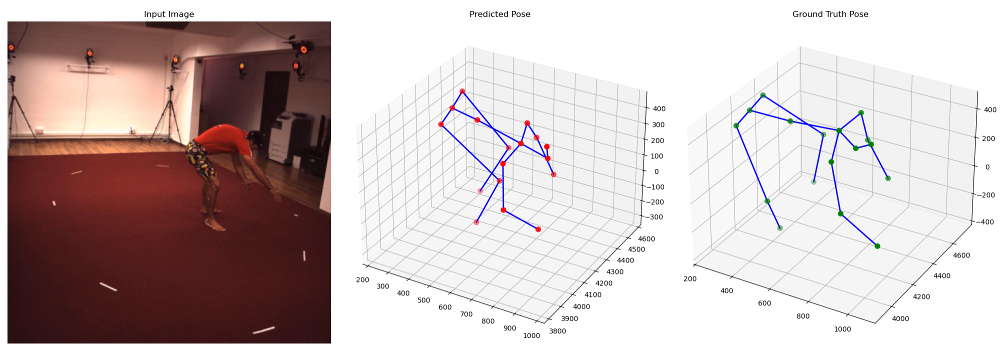
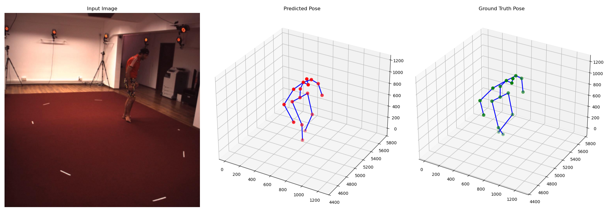

## Vision Transformers

### Position Independent

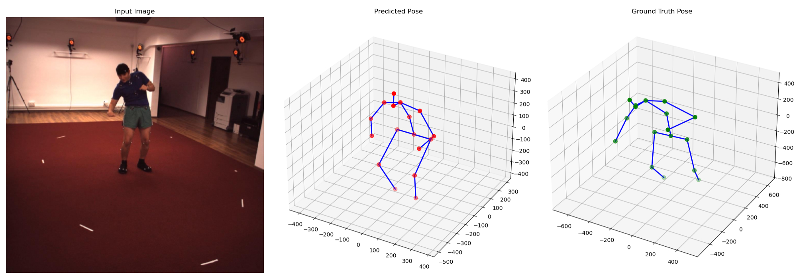
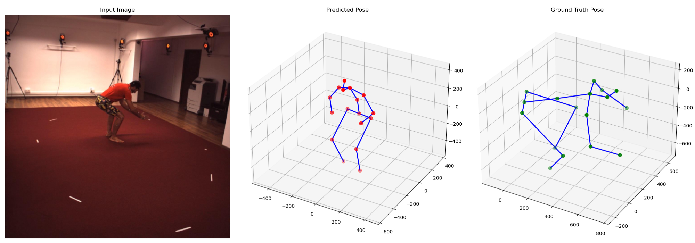
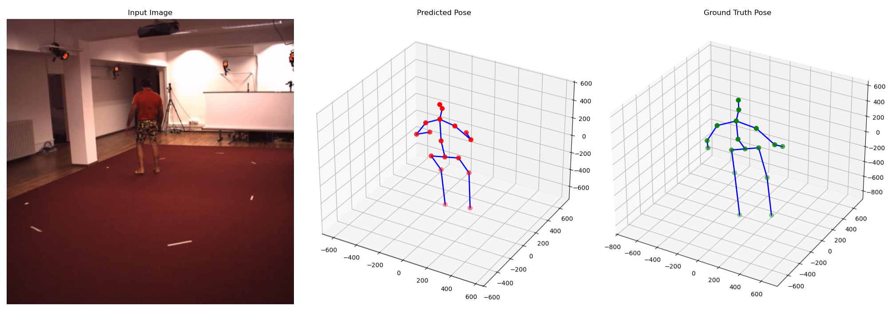
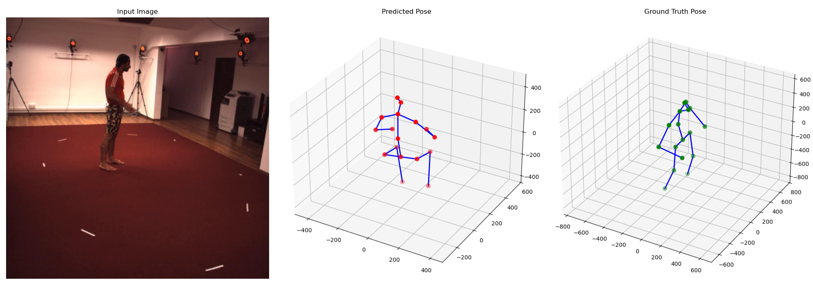

